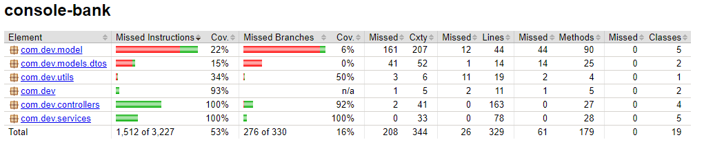

# Console-Bank-App-2 (Backend/API)

## FlowChart

## Tech Stack
- [ ] Java 8
- [ ] Spring Boot
- [ ] Spring Data/JPA
- [ ] Spring WebMvc
- [ ] Spring MockMvc
- [ ] JUnit
- [ ] Mockito
- [ ] Maven
- [ ] AWS Elastic Beanstalk
- [ ] AWS RDS
- [ ] AWS EC2
- [ ] Postgresql
- [ ] Jacoco
- [ ] Git 

## Description

## ER-Diagram

### Jacoco Test Overview (Focus: Controllers & Services)

## API Documentation
- [Endpoint Documentation](https://studio.apicur.io/preview?aid=76452)
- [Javadoc Documentation]()

## Front End
[Front End UI Repository that leverages this API](https://github.com/220620-java/p2-revWork-UI)

## Authors
