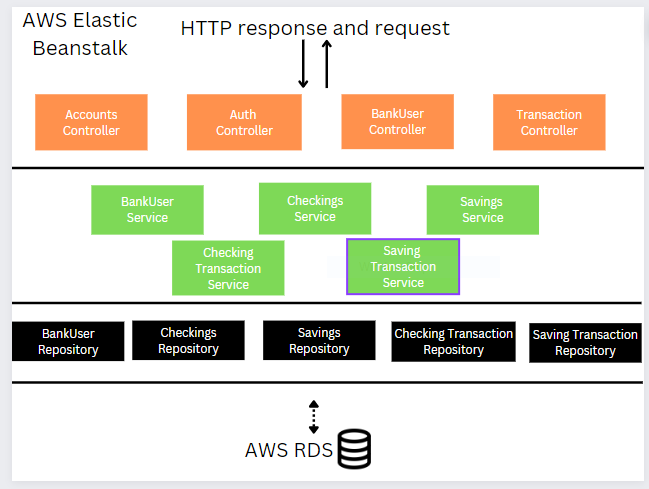
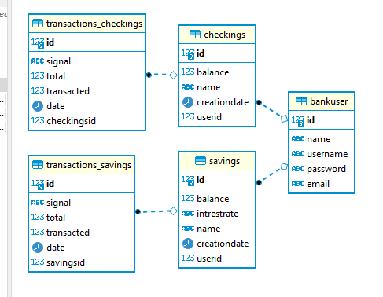

# Console-Bank-App-2 (Backend/API)

## FlowChart

## Tech Stack
- [ ] Java 8
- [ ] Spring Boot
- [ ] Spring Data/JPA
- [ ] Spring WebMvc
- [ ] Spring MockMvc
- [ ] JUnit
- [ ] Mockito
- [ ] Maven
- [ ] AWS Elastic Beanstalk
- [ ] AWS RDS
- [ ] AWS EC2
- [ ] Postgresql
- [ ] Jacoco
- [ ] Git 

## Description
With API Console-Bank 2.0, BankUser's(Secured with JWT tokens) have the possible use cases.

 - Register/Login
 - Edit Profile
 - Create Checking(s)/Saving(s)
 - Delete Checking(s)/Saving(s)
 - View Checking(s)/Saving(s)
 - Withdrawl Checking(s)/Saving(s)
 - Deposit Checking(s)/Saving(s)
 - Apply Interest Saving(s)
 - View Persisted Transactions Checking(s)/Saving(s)
 
## ER-Diagram

### Jacoco Test Overview (Focus: Controllers & Services)

## API Documentation
- [Endpoint Documentation](https://studio.apicur.io/preview?aid=76452)

## Front End
[Front End UI Repository that leverages this API](https://github.com/fsanche3/Console-Bank-2-Frontend)

## Author
[Franklyn Sanchez](https://github.com/fsanche3)
